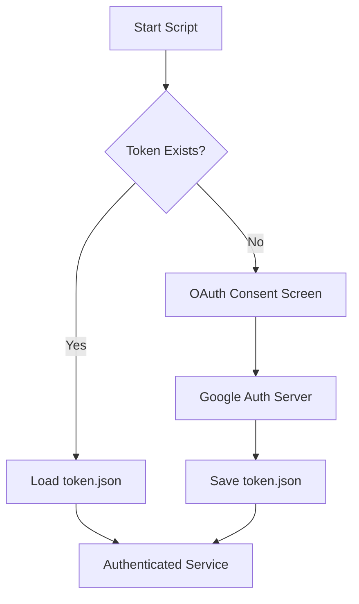
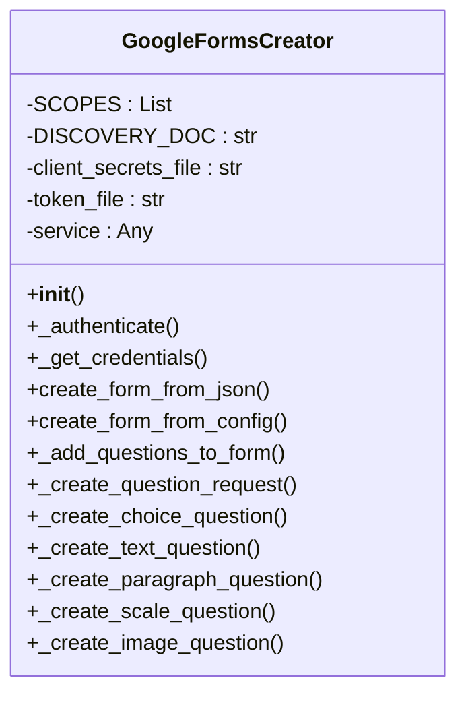
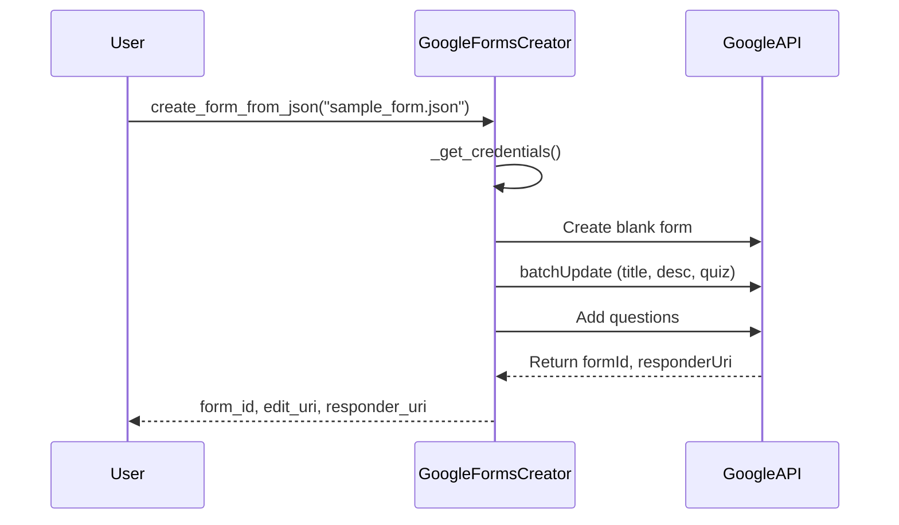

---

# 📋 Google Forms Creator (Python)

Automatically create **Google Forms** (with quiz support, feedback, and images) using Python and the **Google Forms API**.

---

## 🚀 Features

* 🔑 Google OAuth2 Authentication
* 📝 Create Forms from **JSON configuration**
* 🎯 Quiz Support (auto-grading, points, feedback)
* 🖼️ Add Images to Questions
* 📊 Multiple Question Types:

  * Multiple Choice (Radio / Checkbox)
  * Short Answer / Paragraph
  * Linear Scale
  * Image-based Questions

---

## 📂 Project Structure

```
.
├── google_forms_creator.py   # Core class implementation
├── client_secrets.json       # OAuth2 credentials
├── token.json                # Stored access token
├── sample_form.json          # Example form config
└── README.md                 # Documentation
```

---

## ⚡ Setup Instructions

### 1. Enable Google Forms API

* Go to [Google Cloud Console](https://console.cloud.google.com/)
* Create a project & enable **Forms API**
* Download `client_secrets.json` and place it in project root

### 2. Install Dependencies

```bash
pip install google-api-python-client google-auth-httplib2 google-auth-oauthlib
```

### 3. Authentication

First run will open a browser to authenticate with Google. Token is saved in `token.json` for reuse.

---

## 🛠️ Usage

### Create Form from JSON

```python
from google_forms_creator import GoogleFormsCreator

creator = GoogleFormsCreator()

result = creator.create_form_from_json("sample_form.json")
print("Form created!")
print("Form ID:", result["form_id"])
print("Edit URL:", result["edit_uri"])
print("Responder URL:", result["responder_uri"])
```

---

## 📑 Example JSON Config

```json
{
  "form_info": {
    "title": "Test One - Python & Linux Fundamentals",
    "description": "Week One Topics Test - Python, Linux, and Git"
  },
  "is_quiz": true,
  "quiz_settings": {
    "release_score": "IMMEDIATELY"
  },
  "questions": [
    {
      "title": "Which command lists files in Linux?",
      "type": "RADIO",
      "options": ["ls", "pwd", "cd", "touch"],
      "correct_answers": ["ls"],
      "points": 2,
      "required": true,
      "feedback": {
        "correct": "✅ Correct! 'ls' lists files.",
        "incorrect": "❌ Try again. Hint: It starts with 'l'."
      }
    }
  ]
}
```

---

## 📊 Architecture Diagrams

### 🔑 Authentication Flow



---

### 🏗️ Class Design



---

### ⚙️ Workflow



---

## ✅ Output Example

```bash
Form created!
Form ID: 1FAIpQLSfxxxxxxxxxxxx
Edit URL: https://docs.google.com/forms/d/1FAIpQLSfxxxxxxxxxxxx/edit
Responder URL: https://docs.google.com/forms/d/e/1FAIpQLSfxxxxxxxxxxxx/viewform
```

---

## 🧑‍💻 Author

Built with ❤️ by **Jayanth**

---
